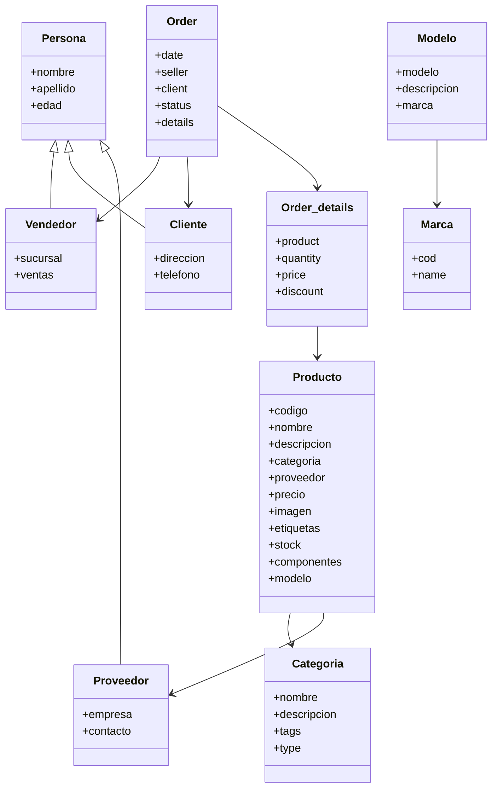

# Practico interfaz grafica
Para IES 21

<br>
<br>

### How to run
Asegurate de levantar una base de datos. <br>
Podés utilizar el docker-compose que dejé para hacerlo<br>
```bash
docker-compose up -d
```
Si no tenés docker instalado, te dejo una guía para instalarlo y poder correrlo<br>
[¿Cómo instalar Docker en windows?](https://learn.microsoft.com/es-es/virtualization/windowscontainers/manage-docker/configure-docker-daemon)
<br>
Lo siguiente es cambiar el string de conexión en:

```bash
src\main\java\negocio\mysql\ConnectionHolder.java:7
```
